# 🚀 AI Resume Generator (AWS Serverless)

> **Intelligent Resume Tailoring with Google Gemini AI**  
> A cloud-native, serverless application that automatically customizes resumes based on job descriptions using AI-powered analysis.

[](https://aws.amazon.com/)
[](https://www.terraform.io/)
[](https://react.dev/)
[](https://www.python.org/)

---

## 📋 Table of Contents

- [Architecture Overview](#-architecture-overview)
- [Tech Stack](#-tech-stack)
- [AWS Services Explained](#-aws-services-explained)
- [Prerequisites](#-prerequisites)
- [Local Development Setup](#-local-development-setup)
- [Cloud Deployment](#-cloud-deployment)
- [API Reference](#-api-reference)
- [CI/CD Pipeline](#-cicd-pipeline)
- [Cost Estimation](#-cost-estimation)
- [Troubleshooting](#-troubleshooting)

---

## 🏗️ Architecture Overview

### High-Level Architecture

```mermaid
graph TB
    subgraph "User Interface"
        User[👤 User Browser]
    end
    
    subgraph "AWS CloudFront CDN"
        CF[CloudFront Distribution]
    end
    
    subgraph "Frontend S3 Hosting"
        S3UI[S3 Bucket<br/>React SPA]
    end
    
    subgraph "API Layer"
        APIGW[API Gateway HTTP API]
    end
    
    subgraph "Compute Layer"
        Lambda[AWS Lambda<br/>Python 3.12 + FastAPI]
    end
    
    subgraph "Storage Layer"
        DDB[(DynamoDB<br/>Job Posts & Resume Metadata)]
        S3Up[S3 Bucket<br/>Uploaded Resumes]
        S3Gen[S3 Bucket<br/>Generated Resumes]
    end
    
    subgraph "Security"
        SM[Secrets Manager<br/>Gemini API Key]
        IAM[IAM Roles & Policies]
    end
    
    subgraph "External Services"
        Gemini[🤖 Google Gemini Flash AI]
        JobSites[💼 Job Sites<br/>LinkedIn, etc.]
    end
    
    User -->|HTTPS| CF
    CF -->|Serves Static Assets| S3UI
    User -->|API Calls| APIGW
    APIGW -->|Invokes| Lambda
    Lambda -->|Store/Retrieve| DDB
    Lambda -->|Upload Original| S3Up
    Lambda -->|Upload Generated| S3Gen
    Lambda -->|Get API Key| SM
    Lambda -->|AI Generation| Gemini
    Lambda -->|Scrape Job Desc| JobSites
    IAM -->|Authorize| Lambda
    
    style User fill:#e1f5ff
    style Lambda fill:#ff9900
    style DDB fill:#4053d6
    style Gemini fill:#34a853
    style CF fill:#ff4f00
```



### Sequence Diagram: Resume Generation Flow


### ASCII Architecture Diagram

```
┌─────────────────────────────────────────────────────────────────┐
│                         USER BROWSER                             │
└───────────┬─────────────────────────────┬───────────────────────┘
            │                             │
            │ HTTPS (Static Assets)      │ HTTPS (API Calls)
            │                             │
┌───────────▼─────────────┐   ┌──────────▼──────────────┐
│     CloudFront CDN       │   │   API Gateway (HTTP)    │
│  ┌────────────────────┐ │   │  ┌───────────────────┐  │
│  │ Cache + SSL/TLS    │ │   │  │ Route: /api/*     │  │
│  │ Global Edge Nodes  │ │   │  │ CORS Enabled      │  │
│  └────────────────────┘ │   │  └───────────────────┘  │
└───────────┬─────────────┘   └──────────┬──────────────┘
            │                             │
            │                             │ Proxy Requests
            │                             │
┌───────────▼─────────────┐   ┌──────────▼──────────────────────┐
│    S3 Frontend Bucket    │   │      AWS Lambda Function        │
│  ┌────────────────────┐ │   │  ┌───────────────────────────┐  │
│  │ index.html         │ │   │  │ Runtime: Python 3.12      │  │
│  │ JavaScript/CSS     │ │   │  │ Framework: FastAPI        │  │
│  │ React SPA          │ │   │  │ Adapter: Mangum           │  │
│  └────────────────────┘ │   │  │                           │  │
└─────────────────────────┘   │  │ Features:                 │  │
                               │  │ • Resume Parsing          │  │
                               │  │ • Job Scraping            │  │
                               │  │ • AI Generation           │  │
                               │  └───────────────────────────┘  │
                               └──────────┬──┬──┬──┬─────────────┘
                                          │  │  │  │
            ┌─────────────────────────────┘  │  │  └───────────────────┐
            │                                │  │                      │
┌───────────▼─────────────┐   ┌─────────────▼──▼────┐   ┌────────────▼──────┐
│    DynamoDB Tables       │   │   S3 Storage Buckets │   │ Secrets Manager   │
│  ┌────────────────────┐ │   │  ┌─────────────────┐ │   │ ┌───────────────┐ │
│  │ JobPosts Table     │ │   │  │ uploads/        │ │   │ │ gemini_api_   │ │
│  │ • id (PK)          │ │   │  │ generated/      │ │   │ │ key_v2        │ │
│  │ • url              │ │   │  └─────────────────┘ │   │ └───────────────┘ │
│  │ • description      │ │   └─────────────────────┘   └───────────────────┘
│  │                    │ │                                       │
│  │ Resumes Table      │ │                                       │
│  │ • id (PK)          │ │                          ┌────────────▼──────────┐
│  │ • filename         │ │                          │  Google Gemini Flash  │
│  │ • content          │ │                          │  ┌──────────────────┐ │
│  │ • s3_key           │ │                          │  │ Latest Model     │ │
│  └────────────────────┘ │                          │  │ AI Generation    │ │
└─────────────────────────┘                          │  └──────────────────┘ │
                                                      └───────────────────────┘
```

---

## 🛠️ Tech Stack

### Frontend
- **Framework**: React 19.2.0
- **Build Tool**: Vite 7.2.4
- **Styling**: Vanilla CSS with modern design patterns
- **HTTP Client**: Axios 1.13.2
- **Document Parsing**: Mammoth.js (DOCX preview)
- **Hosting**: AWS S3 + CloudFront CDN

### Backend
- **Runtime**: Python 3.12
- **Framework**: FastAPI (ASGI)
- **Lambda Adapter**: Mangum
- **AI SDK**: `google-generativeai` (Gemini Flash)
- **Document Processing**: 
  - `python-docx` (DOCX generation)
  - `pypdf` (PDF parsing)
- **Web Scraping**: BeautifulSoup4 + Requests
- **AWS SDK**: Boto3

### Infrastructure
- **IaC**: Terraform (AWS Provider)
- **CI/CD**: GitHub Actions
- **Provisioned Services**:
  - AWS Lambda (Compute)
  - API Gateway HTTP API (Routing)
  - DynamoDB (NoSQL Database)
  - S3 (Object Storage)
  - CloudFront (CDN)
  - Secrets Manager (API Key Storage)
  - IAM (Security & Permissions)

---

## ☁️ AWS Services Explained

### 1. **AWS Lambda**
**Purpose**: Serverless compute for backend API  
**Configuration**:
- Runtime: Python 3.12
- Memory: 512 MB (adjustable)
- Timeout: 30 seconds
- Deployment: ZIP package with dependencies

**Why Lambda?**
- Zero server management
- Pay-per-request pricing (no idle costs)
- Automatic scaling (0 to 1000s of concurrent executions)
- Native integration with API Gateway

---

### 2. **API Gateway (HTTP API)**
**Purpose**: RESTful API endpoint routing  
**Features**:
- Routes requests to Lambda function
- CORS enabled for cross-origin requests
- Built-in throttling and authorization support
- Automatic request/response transformation

**Endpoints**:
- `GET /` - Health check
- `POST /validate-url` - Job URL validation & scraping
- `POST /upload-resume` - Resume file upload
- `POST /generate-resume` - AI-powered resume generation
- `GET /download-resume/{filename}` - Presigned URL retrieval

---

### 3. **DynamoDB**
**Purpose**: NoSQL database for metadata storage  
**Tables**:

#### JobPosts Table
| Attribute   | Type   | Description                    |
|-------------|--------|--------------------------------|
| `id`        | String | UUID (Primary Key)             |
| `url`       | String | Original job posting URL       |
| `description` | String | Scraped job description text |
| `created_at`  | Number | Unix timestamp               |

#### Resumes Table
| Attribute   | Type   | Description                    |
|-------------|--------|--------------------------------|
| `id`        | String | UUID (Primary Key)             |
| `filename`  | String | Original filename              |
| `content`   | String | Parsed resume text             |
| `s3_key`    | String | S3 object path                 |
| `created_at`| Number | Unix timestamp                 |

**Benefits**:
- Single-digit millisecond latency
- Fully managed (no server maintenance)
- Automatic scaling
- Pay-per-request pricing

---

### 4. **S3 (Simple Storage Service)**
**Purpose**: Object storage for files  
**Buckets**:

1. **Frontend Bucket** (`resume-generator-frontend-{random}`)
   - Hosts React SPA static files
   - Public read access via CloudFront
   - Versioning enabled

2. **Uploads Bucket** (`resume-generator-uploads-{random}`)
   - Stores original uploaded resumes
   - Private access (Lambda only)

3. **Generated Bucket** (`resume-generator-generated-{random}`)
   - Stores AI-generated resumes
   - Presigned URLs for temporary access (15 min expiry)

---

### 5. **CloudFront**
**Purpose**: Global content delivery network (CDN)  
**Features**:
- HTTPS/SSL certificate (AWS Certificate Manager)
- Edge caching (reduced latency)
- DDoS protection (AWS Shield Standard)
- Compression (gzip/brotli)
- Custom error pages

**Cache Behavior**:
- Static assets: 24 hours
- HTML files: 5 minutes (for frequent updates)

---

### 6. **Secrets Manager**
**Purpose**: Secure storage for sensitive credentials  
**Stored Secrets**:
- `gemini_api_key_v2`: Google Gemini API key

**Benefits**:
- Automatic encryption at rest (KMS)
- Rotation support
- Audit logging (CloudTrail)
- Fine-grained IAM access control

---

### 7. **IAM (Identity & Access Management)**
**Purpose**: Security and authorization  
**Lambda Execution Role Permissions**:
- `dynamodb:PutItem`, `GetItem`, `Scan`
- `s3:PutObject`, `GetObject`, `DeleteObject`
- `secretsmanager:GetSecretValue`
- `logs:CreateLogGroup`, `CreateLogStream`, `PutLogEvents`

---

## 📦 Prerequisites

### Required Accounts & Tools
- [x] **AWS Account** with billing enabled
- [x] **GitHub Account** for CI/CD
- [x] **Google AI Studio** account ([Get API Key](https://aistudio.google.com/app/apikey))
- [x] **Terraform** >= 1.5.0 ([Install Guide](https://developer.hashicorp.com/terraform/install))
- [x] **AWS CLI** >= 2.0 ([Install Guide](https://docs.aws.amazon.com/cli/latest/userguide/getting-started-install.html))
- [x] **Node.js** >= 20.0 ([Download](https://nodejs.org/))
- [x] **Python** >= 3.12 ([Download](https://www.python.org/downloads/))

### Required Secrets
1. **AWS Credentials**:
   - `AWS_ACCESS_KEY_ID`
   - `AWS_SECRET_ACCESS_KEY`
   - `AWS_REGION` (e.g., `us-east-1`)

2. **API Keys**:
   - `GEMINI_API_KEY` (from Google AI Studio)

---

## 💻 Local Development Setup

### 1. Clone the Repository

```bash
git clone https://github.com/yourusername/Resume-Generator.git
cd Resume-Generator
```

### 2. Backend Setup (Local Testing)

```bash
cd backend

# Create virtual environment
python3.12 -m venv venv
source venv/bin/activate  # On Windows: venv\Scripts\activate

# Install dependencies
pip install -r requirements.txt

# Set environment variables (create .env file)
export GEMINI_API_KEY="your_gemini_api_key"

# Run local server
uvicorn main:app --reload --host 0.0.0.0 --port 8000
```

**Test Endpoint**:
```bash
curl http://localhost:8000/
# Expected: {"message": "Resume Generator API is running"}
```

### 3. Frontend Setup

```bash
cd frontend

# Install dependencies
npm install

# Create .env.local file
echo "VITE_API_URL=http://localhost:8000" > .env.local

# Start development server
npm run dev
```

**Access**: Open http://localhost:5173

---

## 🌩️ Cloud Deployment

### Step 1: Configure GitHub Secrets

Navigate to **GitHub Repo → Settings → Secrets and variables → Actions**:

| Secret Name               | Value                          |
|---------------------------|--------------------------------|
| `AWS_ACCESS_KEY_ID`       | Your AWS access key            |
| `AWS_SECRET_ACCESS_KEY`   | Your AWS secret key            |
| `AWS_REGION`              | `us-east-1` (or your region)   |
| `GEMINI_API_KEY`          | Your Google Gemini API key     |

### Step 2: Terraform Backend Configuration (Optional)

For production, configure remote state:

```hcl
# terraform/backend.tf
terraform {
  backend "s3" {
    bucket         = "your-terraform-state-bucket"
    key            = "resume-generator/terraform.tfstate"
    region         = "us-east-1"
    dynamodb_table = "terraform-locks"
    encrypt        = true
  }
}
```

### Step 3: Deploy via GitHub Actions

```bash
# Push to main branch to trigger deployment
git add .
git commit -m "Initial deployment"
git push origin main
```

**OR** manually trigger workflow:
1. Go to **Actions** tab in GitHub
2. Select **Deploy to AWS** workflow
3. Click **Run workflow**

### Step 4: Retrieve Deployment Outputs

After successful deployment, check workflow logs for outputs:

```bash
Outputs:
api_endpoint = "https://abcd1234.execute-api.us-east-1.amazonaws.com"
cloudfront_domain = "d1234567890abc.cloudfront.net"
frontend_bucket = "resume-generator-frontend-xyz123"
```

### Step 5: Access the Application

Open your browser to: `https://{cloudfront_domain}`

---

## 🔌 API Reference

### Base URL

**Local**: `http://localhost:8000`  
**Production**: `https://{api_gateway_endpoint}`

---

### Endpoints

#### 1. Health Check

```http
GET /
```

**Response**:
```json
{
  "message": "Serverless Resume Generator API is running"
}
```

---

#### 2. Validate Job URL

```http
POST /validate-url
Content-Type: application/json

{
  "url": "https://www.linkedin.com/jobs/view/123456789"
}
```

**Response**:
```json
{
  "valid": true,
  "message": "Valid URL, analyzing the Job Post",
  "data": {
    "job_id": "uuid-here",
    "description_preview": "We are looking for a Senior Software Engineer..."
  }
}
```

---

#### 3. Upload Resume

```http
POST /upload-resume
Content-Type: multipart/form-data

file: resume.pdf (or resume.docx)
```

**Response**:
```json
{
  "message": "It is uploaded successfully",
  "data": {
    "resume_id": "uuid-here",
    "filename": "resume.pdf"
  }
}
```

---

#### 4. Generate Tailored Resume

```http
POST /generate-resume
Content-Type: application/json

{
  "job_id": "uuid-from-validate-url",
  "resume_id": "uuid-from-upload",
  "api_key": "optional-override-key"
}
```

**Response**:
```json
{
  "message": "Resume generated successfully!",
  "download_url": "https://s3.amazonaws.com/bucket/generated/resume_CompanyName.docx?presigned-params",
  "filename": "MyResume_Google.docx"
}
```

---

#### 5. Get Download URL

```http
GET /download-resume/{filename}
```

**Response**:
```json
{
  "url": "https://s3.amazonaws.com/bucket/generated/file.docx?AWSAccessKeyId=..."
}
```

---

### Postman Collection Example

Create a new collection and import these requests:

```json
{
  "info": {
    "name": "Resume Generator API",
    "schema": "https://schema.getpostman.com/json/collection/v2.1.0/collection.json"
  },
  "item": [
    {
      "name": "1. Health Check",
      "request": {
        "method": "GET",
        "header": [],
        "url": {
          "raw": "{{base_url}}/",
          "host": ["{{base_url}}"],
          "path": [""]
        }
      }
    },
    {
      "name": "2. Validate Job URL",
      "request": {
        "method": "POST",
        "header": [
          {
            "key": "Content-Type",
            "value": "application/json"
          }
        ],
        "body": {
          "mode": "raw",
          "raw": "{\n  \"url\": \"https://www.linkedin.com/jobs/view/123456\"\n}"
        },
        "url": {
          "raw": "{{base_url}}/validate-url",
          "host": ["{{base_url}}"],
          "path": ["validate-url"]
        }
      }
    },
    {
      "name": "3. Upload Resume",
      "request": {
        "method": "POST",
        "header": [],
        "body": {
          "mode": "formdata",
          "formdata": [
            {
              "key": "file",
              "type": "file",
              "src": "/path/to/your/resume.pdf"
            }
          ]
        },
        "url": {
          "raw": "{{base_url}}/upload-resume",
          "host": ["{{base_url}}"],
          "path": ["upload-resume"]
        }
      }
    },
    {
      "name": "4. Generate Resume",
      "request": {
        "method": "POST",
        "header": [
          {
            "key": "Content-Type",
            "value": "application/json"
          }
        ],
        "body": {
          "mode": "raw",
          "raw": "{\n  \"job_id\": \"{{job_id}}\",\n  \"resume_id\": \"{{resume_id}}\"\n}"
        },
        "url": {
          "raw": "{{base_url}}/generate-resume",
          "host": ["{{base_url}}"],
          "path": ["generate-resume"]
        }
      }
    }
  ],
  "variable": [
    {
      "key": "base_url",
      "value": "https://your-api-gateway-url.execute-api.us-east-1.amazonaws.com",
      "type": "string"
    },
    {
      "key": "job_id",
      "value": "",
      "type": "string"
    },
    {
      "key": "resume_id",
      "value": "",
      "type": "string"
    }
  ]
}
```

**Usage**:
1. Open Postman
2. Click **Import** → Paste JSON above
3. Update `base_url` variable
4. Run requests in sequence (1 → 2 → 3 → 4)

---

## 🔄 CI/CD Pipeline

### GitHub Actions Workflow

**File**: `.github/workflows/deploy.yml`

#### Workflow Stages


#### Pipeline Steps Breakdown

1. **Backend Pipeline**:
   ```bash
   # Install Python dependencies
   pip install -r backend/requirements.txt -t build_pkg
   
   # Package Lambda
   zip -r backend_lambda.zip .
   
   # Upload to S3 (via Terraform)
   terraform apply
   ```

2. **Terraform Pipeline**:
   ```bash
   terraform fmt -check      # Enforce formatting
   terraform validate        # Syntax validation
   terraform plan           # Preview changes
   terraform apply          # Deploy infrastructure
   ```

3. **Frontend Pipeline**:
   ```bash
   npm install              # Install dependencies
   npm run build            # Create production bundle
   
   # Sync to S3
   aws s3 sync ./frontend/dist s3://{bucket} --delete
   
   # Invalidate CloudFront cache
   aws cloudfront create-invalidation --distribution-id {id} --paths "/*"
   ```

4. **Secrets Management**:
   ```bash
   # Auto-upload Gemini API key
   aws secretsmanager put-secret-value \
     --secret-id gemini_api_key_v2 \
     --secret-string "{\"GEMINI_API_KEY\": \"$GEMINI_API_KEY\"}"
   ```

---

## 💰 Cost Estimation

### Monthly Cost Breakdown (Based on 1,000 resume generations/month)

| Service                | Usage                          | Monthly Cost |
|------------------------|--------------------------------|--------------|
| **API Gateway**        | 1,000 requests                 | $0.01        |
| **Lambda**             | 1,000 invocations × 3s avg     | $0.02        |
| **DynamoDB**           | On-Demand, 2,000 reads/writes  | $0.25        |
| **S3 Storage**         | 10 GB (uploads + generated)    | $0.23        |
| **S3 Requests**        | 5,000 PUT/GET requests         | $0.05        |
| **CloudFront**         | 10 GB data transfer            | $0.85        |
| **Secrets Manager**    | 1 secret                       | $0.40        |
| **External API**       | Gemini Flash (1K req)          | **$0.00***   |
| **Total**              |                                | **~$1.81/month** |

> **\*** Gemini Flash has a generous free tier (1,500 requests/day). See [Gemini Pricing](https://ai.google.dev/pricing).

### Cost Optimization Tips

1. **Enable S3 Lifecycle Policies**:
   ```hcl
   lifecycle_rule {
     enabled = true
     expiration {
       days = 30  # Auto-delete old generated resumes
     }
   }
   ```

2. **Use Lambda Reserved Concurrency** (for predictable workloads):
   - Reduces cold starts
   - Fixed pricing model

3. **CloudFront Cache Tuning**:
   - Increase TTL for static assets
   - Reduces origin requests

4. **DynamoDB Auto-Scaling**:
   - Switch to provisioned capacity for high-volume
   - Can reduce costs by 30-50%

---

## 🤖 Gemini Flash API Reference

### Model Information

**Model**: `gemini-1.5-flash-latest`  
**Provider**: Google Generative AI  
**Documentation**: https://ai.google.dev/docs

### Key Features

- **Fast Response**: 2-3 seconds average
- **Context Window**: 1M tokens (handles long resumes + job descriptions)
- **Multimodal**: Text input/output (future: image support)
- **Safety Filters**: Built-in content moderation

### API Usage in Project

```python
import google.generativeai as genai

# Configure API key
genai.configure(api_key=os.getenv("GEMINI_API_KEY"))

# Initialize model
model = genai.GenerativeModel('gemini-1.5-flash-latest')

# Generate tailored resume
prompt = f"""
You are an expert resume writer. Given the following:

ORIGINAL RESUME:
{resume_content}

JOB DESCRIPTION:
{job_description}

Rewrite the resume to highlight relevant skills and experience for this job.
Keep the same format and structure. Focus on:
1. Matching keywords from the job description
2. Quantifying achievements
3. Emphasizing relevant technical skills
"""

response = model.generate_content(prompt)
tailored_resume = response.text
```

### Rate Limits (Free Tier)

- **Requests per minute (RPM)**: 15
- **Requests per day (RPD)**: 1,500
- **Tokens per minute (TPM)**: 1,000,000

### Pricing (Paid Tier)

| Tier       | Input (per 1M tokens) | Output (per 1M tokens) |
|------------|-----------------------|------------------------|
| Flash      | $0.075                | $0.30                  |
| Pro        | $1.25                 | $5.00                  |

> For this project, Flash is recommended (99% cheaper than Pro).

---

## 🧪 Testing

### Local API Testing with cURL

```bash
# 1. Health check
curl http://localhost:8000/

# 2. Validate job URL
curl -X POST http://localhost:8000/validate-url \
  -H "Content-Type: application/json" \
  -d '{"url":"https://linkedin.com/jobs/view/123"}'

# 3. Upload resume
curl -X POST http://localhost:8000/upload-resume \
  -F "file=@/path/to/resume.pdf"

# 4. Generate resume
curl -X POST http://localhost:8000/generate-resume \
  -H "Content-Type: application/json" \
  -d '{
    "job_id": "uuid-from-step-2",
    "resume_id": "uuid-from-step-3"
  }'
```

### Frontend Testing

```bash
cd frontend
npm run dev

# Build production bundle
npm run build

# Preview production build
npm run preview
```

---

## 🛠️ Troubleshooting

### Common Issues

#### 1. **Terraform Apply Fails**

```bash
Error: Error creating Lambda function: InvalidParameterValueException
```

**Solution**: Ensure Lambda package exists:
```bash
cd terraform
ls -lh backend_lambda.zip  # Should be ~5-10 MB
```

---

#### 2. **CORS Errors in Browser**

```
Access to fetch at '...' has been blocked by CORS policy
```

**Solution**: Update API Gateway CORS settings:
```hcl
# terraform/api_gateway.tf
cors_configuration {
  allow_origins = ["https://your-cloudfront-domain.cloudfront.net"]
  allow_methods = ["GET", "POST", "OPTIONS"]
  allow_headers = ["*"]
}
```

---

#### 3. **Gemini API Rate Limit Exceeded**

```
429 Too Many Requests: Quota exceeded for quota metric 'GenerateContentRequests'
```

**Solution**:
- Wait 60 seconds before retrying
- Implement exponential backoff
- Upgrade to paid tier

---

#### 4. **Lambda Timeout (30s exceeded)**

**Solution**: Increase timeout in `terraform/lambda.tf`:
```hcl
resource "aws_lambda_function" "main" {
  timeout = 60  # Increase to 60 seconds
}
```

---

#### 5. **S3 Presigned URL Expired**

**Solution**: URLs expire after 15 minutes. Regenerate:
```bash
curl http://localhost:8000/download-resume/{filename}
```

---

## 📁 Project Structure

```
Resume-Generator/
├── .github/
│   └── workflows/
│       └── deploy.yml           # CI/CD pipeline
├── backend/
│   ├── main.py                  # Local FastAPI server
│   ├── lambda_main.py           # Lambda handler
│   ├── lambda_db.py             # DynamoDB operations
│   ├── aws_utils.py             # S3/Secrets Manager utils
│   ├── resume_generator.py      # AI generation logic
│   ├── resume_parser.py         # PDF/DOCX parsing
│   ├── scraper.py               # Job description scraping
│   ├── models.py                # SQLAlchemy models (local)
│   └── requirements.txt         # Python dependencies
├── frontend/
│   ├── src/
│   │   ├── App.jsx              # Main React component
│   │   ├── index.css            # Styling
│   │   └── main.jsx             # Entry point
│   ├── public/                  # Static assets
│   ├── package.json             # Node dependencies
│   └── vite.config.js           # Build configuration
├── terraform/
│   ├── main.tf                  # Main infrastructure config
│   ├── lambda.tf                # Lambda configuration
│   ├── api_gateway.tf           # API Gateway setup
│   ├── dynamodb.tf              # Database tables
│   ├── s3.tf                    # Storage buckets
│   ├── cloudfront.tf            # CDN distribution
│   ├── secrets_manager.tf       # Secrets configuration
│   ├── iam.tf                   # Permissions & roles
│   ├── outputs.tf               # Deployment outputs
│   ├── variables.tf             # Input variables
│   └── providers.tf             # AWS provider config
├── DEPLOYMENT_SETUP.md          # Deployment guide
├── PROJECT_DOCUMENTATION.md     # Detailed project docs
└── README.md                    # This file
```

---

## 🤝 Contributing

Contributions are welcome! Please follow these steps:

1. Fork the repository
2. Create a feature branch: `git checkout -b feature/amazing-feature`
3. Commit changes: `git commit -m 'Add amazing feature'`
4. Push to branch: `git push origin feature/amazing-feature`
5. Open a Pull Request

---

## 📄 License

Copyright © 2025 Veekshith Gullapudi. All rights reserved.

---

## 🙏 Acknowledgments

- **Google Generative AI** for Gemini Flash API
- **AWS** for serverless infrastructure
- **Terraform** for IaC tooling
- **FastAPI** & **React** communities

---

## 📧 Contact

**Author**: Veekshith Gullapudi  
**GitHub**: [@veekshith9510](https://github.com/veekshith9510)  
**Project Link**: https://github.com/veekshith9510/Resume-Generator

---

<div align="center">
  <sub>Built with ❤️ using AWS, React, and AI</sub>
</div>
